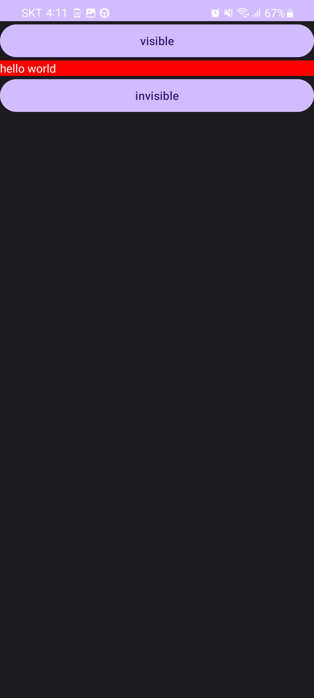
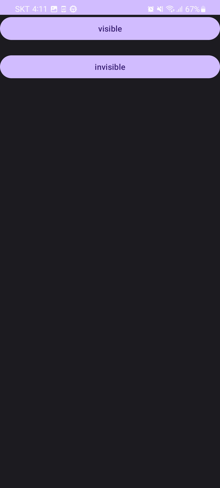


# 06-1 화면을 구성하는 방법
- 화면을 출력하는 컴포넌트는 엑티비뿐입니다.

- 화면 구성은 엑티비티 코드와 레이아웃 XML 2가지 방법으로 구현 가능하지만 효율성을 고려한다면 XML 파일로 화면을 구성하는 것이 더 좋습니다.
    - XML (activity_main.xml): 화면 구현 코드 
    - 엑티비티 (MainActivity.kt): 네트워킹, 데이터 핸들링, 사용자 이벤트 처리 등의 코드 

# 06-2 뷰 클래스
## 레이아웃 XML로 화면 구성하기
주요 태그: `LinearLayout` `TextView` `ImageView` `Button`
```xml
<!--147p-->
<?xml version="1.0" encoding="utf-8"?>
<LinearLayout xmlns:android="http://schemas.android.com/apk/res/android"
    xmlns:app="http://schemas.android.com/apk/res-auto"
    xmlns:tools="http://schemas.android.com/tools"
    android:layout_width="match_parent"
    android:layout_height="match_parent"
    android:orientation="vertical"
    android:gravity="center">
    
    <TextView
        android:layout_width="wrap_content"
        android:layout_height="wrap_content"
        android:textStyle="bold"
        android:text="Lake Louise"
        />
    <ImageView
        android:layout_width="wrap_content"
        android:layout_height="wrap_content"
        android:src="@drawable/ic_launcher_background"
        />
    <TextView
        android:layout_width="wrap_content"
        android:layout_height="wrap_content"
        android:textStyle="bold"
        android:text="Lake Louise, AB, 캐나다" />

</LinearLayout>
```

## 레이아웃 중첩
LinearLayout 객체에 다른 LinearLayout 객체를 포함하여 화면을 구성

컴포지트 패턴(문서 객체 모델): 객체를 계층 구조로 만들어 이용
```xml
<!--151p-->
<?xml version="1.0" encoding="utf-8"?>
<LinearLayout xmlns:android="http://schemas.android.com/apk/res/android"
    xmlns:app="http://schemas.android.com/apk/res-auto"
    xmlns:tools="http://schemas.android.com/tools"
    android:layout_width="match_parent"
    android:layout_height="match_parent"
    android:orientation="vertical">

   <Button
       android:layout_width="wrap_content"
       android:layout_height="wrap_content"
       android:text="BUTTON1"/>
    <Button
        android:layout_width="wrap_content"
        android:layout_height="wrap_content"
        android:text="BUTTON2"/>
    <LinearLayout
        android:layout_width="wrap_content"
        android:layout_height="wrap_content"
        android:orientation="horizontal">
        <Button
            android:layout_width="wrap_content"
            android:layout_height="wrap_content"
            android:text="BUTTON3"/>
        <Button
            android:layout_width="wrap_content"
            android:layout_height="wrap_content"
            android:text="BUTTON4"/>
    </LinearLayout>
</LinearLayout>

```

## 뷰의 크기를 지정하는 방법
주요 태그: `layout_width` `layout_height`
```xml
<!--155p-->
<?xml version="1.0" encoding="utf-8"?>
<LinearLayout xmlns:android="http://schemas.android.com/apk/res/android"
    android:layout_width="match_parent"
    android:layout_height="match_parent"
    android:orientation="vertical"
    android:background="#ffff00">

    <TextView
        android:id="@+id/text1"
        android:layout_width="wrap_content"
        android:layout_height="wrap_content"
        android:text="Hello"/>
   <Button
       android:layout_width="match_parent"
       android:layout_height="wrap_content"
       android:text="BUTTON1"/>
    
    <Button
        android:layout_width="wrap_content"
        android:layout_height="wrap_content" 
        android:text="BUTTON2"/>

</LinearLayout>

```

## 뷰의 간격 설정
주요 태그: `margin` `padding`
```xml
<!--157p-->
<?xml version="1.0" encoding="utf-8"?>
<LinearLayout xmlns:android="http://schemas.android.com/apk/res/android"
    android:layout_width="match_parent"
    android:layout_height="match_parent"
    android:orientation="vertical">

   <Button
       android:layout_width="wrap_content"
       android:layout_height="wrap_content"
       android:text="BUTTON1"
       android:backgroundTint="#0000ff"
       android:padding="30dp"/>

    <Button
        android:layout_width="match_parent"
        android:layout_height="wrap_content"
        android:text="BUTTON2"
        android:backgroundTint="#ff0000"
        android:padding="50dp"
        android:layout_marginLeft="50dp"/>
</LinearLayout>

```
## 뷰의 표시 여부 설정
주요 태그: `visibility`
```xml
<!--158p-->
<?xml version="1.0" encoding="utf-8"?>
<LinearLayout xmlns:android="http://schemas.android.com/apk/res/android"
    android:layout_width="match_parent"
    android:layout_height="match_parent"
    android:orientation="vertical">

   <Button
       android:layout_width="wrap_content"
       android:layout_height="wrap_content"
       android:text="BUTTON1"
       android:backgroundTint="#0000ff"
       android:padding="30dp"
       android:visibility="invisible" />

    <Button
        android:layout_width="match_parent"
        android:layout_height="wrap_content"
        android:text="BUTTON2"
        android:backgroundTint="#ff0000"
        android:padding="50dp"
        android:layout_marginLeft="50dp"
        android:visibility="visible"/>
</LinearLayout>

```

코드에서 속성값을 조정하는 경우
```kotlin
visibleBtn.setOnClickListener{
    targetView.visibility = View.VISIBLE    // 출력됨
}

invisibleBtn.setOnClickListener{
    targetView.visibility = View.INVISIBLE  // 출력 안됨
}
```
# 06-3 기본적인 뷰 살펴보기
### 텍스트 뷰
주요 태그: `text` `textColor` `textSize` `textStyle` `autoLink` `maxLines` `ellipsize`

### 이미지 뷰
주요 태그: `ImageView` `src` `adjustViewBounds` `maxHeight` `maxWidth` 

### 버튼, 체크박스, 라디오 버튼
주요 태그: `Button` `CheckBox` `RadioButton` `RadioGroup`

### 에디트 텍스트(입력)
주요 태그: `EditText` `lines` `maxLines` `inputType`

# 06-4 뷰 바인딩
레이아웃 XML 파일에 선언한 뷰 객체를 코드에서 쉽게 이용하는 방법

```xml
<!--169p-xml파일-->
<?xml version="1.0" encoding="utf-8"?>
<LinearLayout xmlns:android="http://schemas.android.com/apk/res/android"
    android:layout_width="match_parent"
    android:layout_height="match_parent"
    android:orientation="vertical">

    <Button
        android:id="@+id/visibleBtn"
        android:layout_width="match_parent"
        android:layout_height="wrap_content"
        android:text="visible"/>
    
    <TextView
        android:id="@+id/targetView"
        android:layout_width="match_parent"
        android:layout_height="wrap_content"
        android:text="hello world"
        android:background="#FF0000"
        android:textColor="FFFFFF"/>
    
    <Button
        android:id="@+id/invisible"
        android:layout_width="match_parent"
        android:layout_height="wrap_content"
        android:text="invisible"/>
</LinearLayout>
```
xml에서 선언한 뷰의 id값으로 뷰 객체를 코드에서 사용할 수 있다.

코드에서 `findViewById()`으로 사용 가능

다만, ViewBinding 허용으로 더 쉽게 사용가능
```kotlin
// build.gradle 파일에서 android 영역에 코드를 추가
buildFeatures {
    viewBinding = true
}
```
위 코드를 적용하면 레이아웃 XML 파일에 등록된 뷰 객체를 포함하는 클래스가 자동으로 만들어집니다.

`FindViewById()`함수를 호출하지 않아도 이를 구현한 클래스가 자동으로 만들어지므로 이 클래스를 이용해 뷰를 사용하기만 하면 됩니다.

```xml
<?xml version="1.0" encoding="utf-8"?>
<LinearLayout xmlns:android="http://schemas.android.com/apk/res/android"
    android:layout_width="match_parent"
    android:layout_height="match_parent"
    android:orientation="vertical">

    <Button
        android:id="@+id/visibleBtn"
        android:layout_width="match_parent"
        android:layout_height="wrap_content"
        android:text="visible"/>

    <TextView
        android:id="@+id/targetView"
        android:layout_width="match_parent"
        android:layout_height="wrap_content"
        android:text="hello world"
        android:background="#FF0000"
        android:textColor="#FFFFFF"/>

    <Button
        android:id="@+id/invisibleBtn"
        android:layout_width="match_parent"
        android:layout_height="wrap_content"
        android:text="invisible"/>
</LinearLayout>
```

``` kotlin
package com.example.androidlab

import android.graphics.Typeface
import androidx.appcompat.app.AppCompatActivity
import android.os.Bundle
import android.os.PersistableBundle
import android.provider.ContactsContract.CommonDataKinds.Email
import android.view.Gravity
import android.view.View
import android.view.ViewGroup.LayoutParams.WRAP_CONTENT
import android.widget.ImageView
import android.widget.LinearLayout
import android.widget.TextView
import androidx.core.content.ContextCompat
import com.example.androidlab.databinding.ActivityMainBinding


class MainActivity : AppCompatActivity() {

    override fun onCreate(savedInstanceState: Bundle?) {
        super.onCreate(savedInstanceState)

        // 바인딩 객체 획득
        val binding = ActivityMainBinding.inflate(layoutInflater)
        // 액티비티 화면 출력
        setContentView(binding.root)

        // 뷰 객체 이용
        binding.visibleBtn.setOnClickListener{
            binding.targetView.visibility = View.VISIBLE
        }
        binding.invisibleBtn.setOnClickListener{
            binding.targetView.visibility = View.INVISIBLE
        }
    }
}
```

실행결과:

visible을 누를 경우 "hello world" TEXT박스가 나옵니다.

invisible을 누를 경우 "hello world" TEXT박스가 사라집니다.

*안드로이드 스튜디오의 버전이 바뀌면서 바인딩 방법도 변경되었으므로 공식문서를 참조할 것
  
[뷰 바인딩 공식문서](https://developer.android.com/topic/libraries/view-binding?hl=ko#kotlin)


# 태그 모음
### 레이아웃 배치
`LinearLayout` : 레이아웃 객체

### 텍스트 뷰
`TextView` : 문자열을 출력

`text` : 문자열 리소스 지정 가능 ("@string/hello")

`textColor` : 문자열 색상을 지정

`textSize` : 문자열의 크기를 지정

`textStyle` : 문자열의 스타일을 지정
- `bold`
- `italic`
- `normal`

`autoLink` : 출력할 문자열 분석해 특정 형태의 문자열에 자동 링크를 추가
- `web`
- `phone`
- `email`

`maxLines` : 긴 문자열을 자동으로 줄바꿈
- `수치` : 수치가 5일 경우 5행 까지만 출력 

`ellipsize` : `maxLines`에서 잘린 문자열이 잇다는 것을 표시
- `end` : 문자열 뒤에 줄임표(...)이 추가
- `start` : 줄임표를 앞 부분에 추가, `singleLine="true"`일때만 적용
- `middle` : 줄임표를 중간 부분에 추가, `singleLine="true"`일때만 적용

### 이미지 뷰
`ImageView` : 이미지를 출력

`src` : 출력할 이미지를 설정, `"@drawable/image"`

`adjustViewBounds` : 이미지의 가로세로 길이와 비례해 뷰의 크기에 맞춤
- `true` : 가로세로 비율 유지

`maxHeight` : 최대 세로 크기 지정, `adjustViewBounds`와 함께 사용 해야됨

`maxWidth` : 최대 가로 크기 지정, `adjustViewBounds`와 함께 사용 해야됨

### 버튼, 체크박스, 라디오 버튼
`Button` : 사용자 이벤트 처리

`CheckBox` : 다중 선택

`RadioButton` : 단일 선택, `RadioGroup`으로 묶어서 사용

### 에디트 텍스트(입력)
`EditText` : 사용자가 문자열을 입력, 한줄의 입력 줄이 나오며 엔터를 누르면 행이 늘어남

`lines` : 
- `수치` : `lines=:"3"`으로 설정하면 입력줄의 출력 크기(행)가 3줄로 고정, 3줄이 넘어가면 스크롤이 됨 

`maxLines` : 한줄의 입력 줄이 나오며 엔터를 누르면 행이 늘어남, 최대 행을 넘길 수 없음
- `수치` : `maxLines="3"`으로 설정하면 한줄의 입력줄이 처음에 나오고, 입력은 최대 3줄을 넘길 수 없음

`inputType` : 글을 입력할 때 올라오는 키보드를 지정
- `text` : 한줄 입력
- `textUri` : URL 입력
- `textPassword` : 비밀번호 입력, 입력한 문자를 점으로 표시, 키보드에 영문자, 숫자, 특수키만 표시
- `number` : 숫자 입력
- `phone` : 전화번호 입력
- 대문자 입력, 여러 줄 입력, 소수점 입력등 여러가지 속성값이 있음

### 뷰의 상태(모양)
`layout_width` : 가로 크기

- `수치` `px` `dp`
- `match_parent` : 부모의 크기 전체
- `wrap_content` : 자신의 콘텐츠를 화면에 출력할 수 있는 적절한 크기

`layout_height` : 세로 크기

- `수치` `px` `dp`
- `match_parent` : 부모의 크기 전체
- `wrap_content` : 자신의 콘텐츠를 화면에 출력할 수 있는 적절한 크기

`margin` : 뷰와 뷰 사이의 간격
- `layout_marginLeft`
- `layout_marginRight`
- `layout_marginTop`
- `layout_marginBottom`

`padding` : 뷰의 콘텐츠와 테두리 사이의 간격
- `paddingLeft`
- `paddingRight`
- `paddingTop`
- `paddingBottom`

`visibility` : 뷰가 화면에 출력되어야 하는지를 설정
- `visible` : 출력됨 (기본값)
- `invisible` : 뷰가 화면에 출력되지 않음, 뷰가 보이지는 않지만 자리는 차지
- `gone` : 뷰가 화면에 출력되지 않음, 뷰가 자리도 차지하지 않음

### 추가 예정
