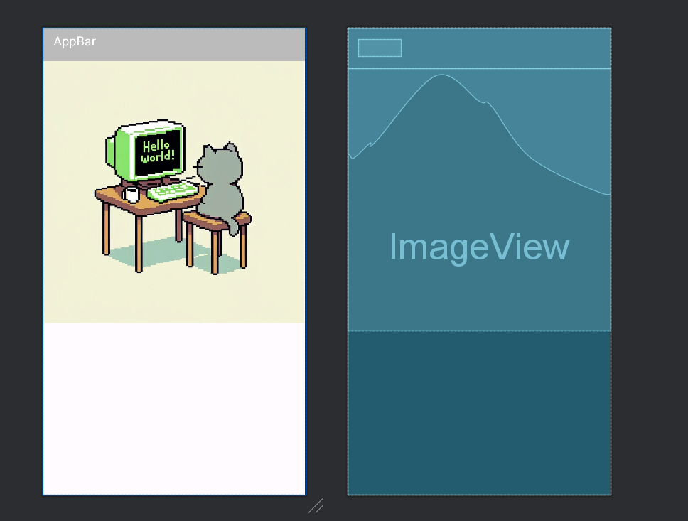


# 06-1 화면을 구성하는 방법
- 화면을 출력하는 컴포넌트는 엑티비뿐입니다.

- 화면 구성은 엑티비티 코드와 레이아웃 XML 2가지 방법으로 구현 가능하지만 효율성을 고려한다면 XML 파일로 화면을 구성하는 것이 더 좋습니다.
    - XML (activity_main.xml): 화면 구현 코드 
    - 엑티비티 (MainActivity.kt): 네트워킹, 데이터 핸들링, 사용자 이벤트 처리 등의 코드 

# 06-2 뷰 클래스
## 레이아웃 XML로 화면 구성하기
주요 태그: `LinearLayout` `TextView` `ImageView` `Button`
```xml
<!--147p-->
<?xml version="1.0" encoding="utf-8"?>
<LinearLayout xmlns:android="http://schemas.android.com/apk/res/android"
    xmlns:app="http://schemas.android.com/apk/res-auto"
    xmlns:tools="http://schemas.android.com/tools"
    android:layout_width="match_parent"
    android:layout_height="match_parent"
    android:orientation="vertical"
    android:gravity="center">
    
    <TextView
        android:layout_width="wrap_content"
        android:layout_height="wrap_content"
        android:textStyle="bold"
        android:text="Lake Louise"
        />
    <ImageView
        android:layout_width="wrap_content"
        android:layout_height="wrap_content"
        android:src="@drawable/ic_launcher_background"
        />
    <TextView
        android:layout_width="wrap_content"
        android:layout_height="wrap_content"
        android:textStyle="bold"
        android:text="Lake Louise, AB, 캐나다" />

</LinearLayout>
```

## 레이아웃 중첩
LinearLayout 객체에 다른 LinearLayout 객체를 포함하여 화면을 구성

컴포지트 패턴(문서 객체 모델): 객체를 계층 구조로 만들어 이용
```xml
<!--151p-->
<?xml version="1.0" encoding="utf-8"?>
<LinearLayout xmlns:android="http://schemas.android.com/apk/res/android"
    xmlns:app="http://schemas.android.com/apk/res-auto"
    xmlns:tools="http://schemas.android.com/tools"
    android:layout_width="match_parent"
    android:layout_height="match_parent"
    android:orientation="vertical">

   <Button
       android:layout_width="wrap_content"
       android:layout_height="wrap_content"
       android:text="BUTTON1"/>
    <Button
        android:layout_width="wrap_content"
        android:layout_height="wrap_content"
        android:text="BUTTON2"/>
    <LinearLayout
        android:layout_width="wrap_content"
        android:layout_height="wrap_content"
        android:orientation="horizontal">
        <Button
            android:layout_width="wrap_content"
            android:layout_height="wrap_content"
            android:text="BUTTON3"/>
        <Button
            android:layout_width="wrap_content"
            android:layout_height="wrap_content"
            android:text="BUTTON4"/>
    </LinearLayout>
</LinearLayout>

```

## 뷰의 크기를 지정하는 방법
주요 태그: `layout_width` `layout_height`
```xml
<!--155p-->
<?xml version="1.0" encoding="utf-8"?>
<LinearLayout xmlns:android="http://schemas.android.com/apk/res/android"
    android:layout_width="match_parent"
    android:layout_height="match_parent"
    android:orientation="vertical"
    android:background="#ffff00">

    <TextView
        android:id="@+id/text1"
        android:layout_width="wrap_content"
        android:layout_height="wrap_content"
        android:text="Hello"/>
   <Button
       android:layout_width="match_parent"
       android:layout_height="wrap_content"
       android:text="BUTTON1"/>
    
    <Button
        android:layout_width="wrap_content"
        android:layout_height="wrap_content" 
        android:text="BUTTON2"/>

</LinearLayout>

```

## 뷰의 간격 설정
주요 태그: `margin` `padding`
```xml
<!--157p-->
<?xml version="1.0" encoding="utf-8"?>
<LinearLayout xmlns:android="http://schemas.android.com/apk/res/android"
    android:layout_width="match_parent"
    android:layout_height="match_parent"
    android:orientation="vertical">

   <Button
       android:layout_width="wrap_content"
       android:layout_height="wrap_content"
       android:text="BUTTON1"
       android:backgroundTint="#0000ff"
       android:padding="30dp"/>

    <Button
        android:layout_width="match_parent"
        android:layout_height="wrap_content"
        android:text="BUTTON2"
        android:backgroundTint="#ff0000"
        android:padding="50dp"
        android:layout_marginLeft="50dp"/>
</LinearLayout>

```
## 뷰의 표시 여부 설정
주요 태그: `visibility`
```xml
<!--158p-->
<?xml version="1.0" encoding="utf-8"?>
<LinearLayout xmlns:android="http://schemas.android.com/apk/res/android"
    android:layout_width="match_parent"
    android:layout_height="match_parent"
    android:orientation="vertical">

   <Button
       android:layout_width="wrap_content"
       android:layout_height="wrap_content"
       android:text="BUTTON1"
       android:backgroundTint="#0000ff"
       android:padding="30dp"
       android:visibility="invisible" />

    <Button
        android:layout_width="match_parent"
        android:layout_height="wrap_content"
        android:text="BUTTON2"
        android:backgroundTint="#ff0000"
        android:padding="50dp"
        android:layout_marginLeft="50dp"
        android:visibility="visible"/>
</LinearLayout>

```

코드에서 속성값을 조정하는 경우
```kotlin
visibleBtn.setOnClickListener{
    targetView.visibility = View.VISIBLE    // 출력됨
}

invisibleBtn.setOnClickListener{
    targetView.visibility = View.INVISIBLE  // 출력 안됨
}
```
# 06-3 기본적인 뷰 살펴보기
### 텍스트 뷰
주요 태그: `text` `textColor` `textSize` `textStyle` `autoLink` `maxLines` `ellipsize`

### 이미지 뷰
주요 태그: `ImageView` `src` `adjustViewBounds` `maxHeight` `maxWidth` 

### 버튼, 체크박스, 라디오 버튼
주요 태그: `Button` `CheckBox` `RadioButton` `RadioGroup`

### 에디트 텍스트(입력)
주요 태그: `EditText` `lines` `maxLines` `inputType`

# 06-4 뷰 바인딩
레이아웃 XML 파일에 선언한 뷰 객체를 코드에서 쉽게 이용하는 방법

```xml
<!--169p-xml파일-->
<?xml version="1.0" encoding="utf-8"?>
<LinearLayout xmlns:android="http://schemas.android.com/apk/res/android"
    android:layout_width="match_parent"
    android:layout_height="match_parent"
    android:orientation="vertical">

    <Button
        android:id="@+id/visibleBtn"
        android:layout_width="match_parent"
        android:layout_height="wrap_content"
        android:text="visible"/>
    
    <TextView
        android:id="@+id/targetView"
        android:layout_width="match_parent"
        android:layout_height="wrap_content"
        android:text="hello world"
        android:background="#FF0000"
        android:textColor="FFFFFF"/>
    
    <Button
        android:id="@+id/invisible"
        android:layout_width="match_parent"
        android:layout_height="wrap_content"
        android:text="invisible"/>
</LinearLayout>
```
xml에서 선언한 뷰의 id값으로 뷰 객체를 코드에서 사용할 수 있다.

코드에서 `findViewById()`으로 사용 가능

다만, ViewBinding 허용으로 더 쉽게 사용가능
```kotlin
// build.gradle 파일에서 android 영역에 코드를 추가
buildFeatures {
    viewBinding = true
}
```
위 코드를 적용하면 레이아웃 XML 파일에 등록된 뷰 객체를 포함하는 클래스가 자동으로 만들어집니다.

`FindViewById()`함수를 호출하지 않아도 이를 구현한 클래스가 자동으로 만들어지므로 이 클래스를 이용해 뷰를 사용하기만 하면 됩니다.

```xml
<?xml version="1.0" encoding="utf-8"?>
<LinearLayout xmlns:android="http://schemas.android.com/apk/res/android"
    android:layout_width="match_parent"
    android:layout_height="match_parent"
    android:orientation="vertical">

    <Button
        android:id="@+id/visibleBtn"
        android:layout_width="match_parent"
        android:layout_height="wrap_content"
        android:text="visible"/>

    <TextView
        android:id="@+id/targetView"
        android:layout_width="match_parent"
        android:layout_height="wrap_content"
        android:text="hello world"
        android:background="#FF0000"
        android:textColor="#FFFFFF"/>

    <Button
        android:id="@+id/invisibleBtn"
        android:layout_width="match_parent"
        android:layout_height="wrap_content"
        android:text="invisible"/>
</LinearLayout>
```

```kotlin
package com.example.androidlab

import android.graphics.Typeface
import androidx.appcompat.app.AppCompatActivity
import android.os.Bundle
import android.os.PersistableBundle
import android.provider.ContactsContract.CommonDataKinds.Email
import android.view.Gravity
import android.view.View
import android.view.ViewGroup.LayoutParams.WRAP_CONTENT
import android.widget.ImageView
import android.widget.LinearLayout
import android.widget.TextView
import androidx.core.content.ContextCompat
import com.example.androidlab.databinding.ActivityMainBinding


class MainActivity : AppCompatActivity() {

    override fun onCreate(savedInstanceState: Bundle?) {
        super.onCreate(savedInstanceState)

        // 바인딩 객체 획득
        val binding = ActivityMainBinding.inflate(layoutInflater)
        // 액티비티 화면 출력
        setContentView(binding.root)

        // 뷰 객체 이용
        binding.visibleBtn.setOnClickListener{
            binding.targetView.visibility = View.VISIBLE
        }
        binding.invisibleBtn.setOnClickListener{
            binding.targetView.visibility = View.INVISIBLE
        }
    }
}
```

실행결과:
 
visible을 누를 경우 "hello world" TEXT박스가 나옵니다.

invisible을 누를 경우 "hello world" TEXT박스가 사라집니다.

*안드로이드 스튜디오의 버전이 바뀌면서 바인딩 방법도 변경되었으므로 공식문서를 참조할 것
  
[뷰 바인딩 공식문서](https://developer.android.com/topic/libraries/view-binding?hl=ko#kotlin)

# 07-1 선형으로 배치 - LinearLayout
뷰를 가로나 세로 방향으로 나열하는 레이아웃 클래스
- `orientation` 나열 방향 설정
    - `horizontal` 가로 나열
    - `vertical` 새로 나열

- `layout_weight` 여백의 비율 (가중치)
    - `1` 여백을 뷰로 채움

- `gravity` 콘텐츠 정렬
- `layout_gravity` 뷰 정렬

# 07-2 상대 위치로 배치 - RelativeLayout
상대 뷰의 위치를 기준으로 정렬하는 레이아웃 클래스

- `layout_above` : 기준 뷰의 위쪽에 배치
- 
- `layout_below` : 기준 뷰의 아래쪽에 배치
- 
- `layout_toLeftOf` : 기준 뷰의 왼쪽에 배치
- 
- `layout_toRightOf` : 기준 뷰의 오른쪽에 배치

- `layout_alignTop` : 기준 뷰와 위쪽을 맞춤

- `layout_alignBottom` : 기준 뷰와 아래쪽을 맞춤

- `layout_alignLeft` : 기준 뷰와 왼쪽을 맞춤

- `layout_alignRight` : 기준 뷰와 오른쪽을 맞춤

- `layout_alignBaseline` : 기준 뷰와 텍스트 기준선을 맞춤'

- `layout_alignParentTop` : 부모의 위쪽에 맞춤
  
- `layout_alignParentBottom` : 부모의 아래쪽에 맞춤
  
- `layout_alignParentLeft` : 부모의 왼쪽에 맞춤
  
- `layout_alignParentRight` : 부모의 오른쪽에 맞춤
  
- `layout_alignParentHorizontal` : 부모의 가로 방향 중앙에 맞춤
  
- `layout_alignParentVertical` : 부모의 세로 방향 중앙에 맞춤
  
- `layout_alignParentInParent` : 부모의 가로,세로 중앙에 맞춤

# 07-3 겹쳐서 배치 - FrameLayout
뷰를 겹쳐서 출력하는 레이아웃

- 방향이나 상대위치를 조절하는 속성이 없다.

`invisible`

# 07-4 표 형태로 배치 - GridLayout
행과 열로 구성된 테이블 화면을 만드는 레이아웃 클래스

- `orientation` : 방향 설정
    - `horizontal`
    - `vertical`
  
- `rowCount` : 세로로 나열할 뷰 개수

- `columnCount` : 가로로 나열할 뷰 개수
  
- `layout_row` : 뷰가 위치하는 세로 방향 인덱스
  
- `layout_column` : 뷰가 위치하는 가로 방향 인덱스
  
- `layout_gravity` : 뷰의 크기 조정
  
- `layout_columnSpan` : 가로로 열 병합
  
- `layout_rowSpan` : 세로로 행 병합

# 07-5 계층 구조로 배치 - ConstraintLayout
코드가 아닌 마우스로 레이아웃을 구성하는 레이아웃 편집기

상대 뷰의 위치를 기준으로 정렬하는 RelativeLayout 레이아웃 클래스와 유사

# 08-1 터치와 키 이벤트
### 터치 이벤트
터치: 앱의 화면에서 발생하는 사용자 이벤트

이벤트 콜백 함수 `onTouchEvent()` 사용

`콜백함수` : 어떤 이벤트가 발생하거나 시점에 도달 했을 때 시스템에서 자동으로 호출되는 함수

`ACTION_DOWN` : 화면에서 손가락으로 누른 순간

`ACTION_UP` : 화면에서 손가락을 떼는 순간

`ACTION_MOVE` : 화면에서 손가락으로 누른 채로 이동하는 순간

`x` : 이벤트가 발생한 뷰의 x 좌표

`y` : 이벤트가 발생한 뷰의 y 좌표

`rawX` : 화면의 x 좌표

`rawY` : 화면의 Y 좌표

### 키 이벤트
사용자가 폰의 키를 누르는 순간에 발생

`onKeyDown` : 키를 누른 순간의 이벤트

`onKeyUp` : 키를 떼는 순간의 이벤트

`onKeyLongPress` : 키를 오래 누르는 순간의 이벤트

### 뷰 이벤트
- 이벤트 소스: 이벤트가 발생한 객체
- 이벤트 핸들러: 이벤트 발생 시 실행할 로직이 구현된 객체
- 리스너: 이벤트 소스와 이벤트 핸들러를 연결해 주는 함수

이벤트 소스 - 리스너 - 이벤트 핸들러

# 머티리얼 라이브러리
구글의 머티리얼 디자인은 모바일과 데스크톱, 그리고 그 밖에 다양한 장치를 아우르는 일관된 애플리케이션 디자인 지침

### 앱바 레이아웃 - 화면 위쪽 영역 꾸미기
앱바: 화면 위쪽의 꾸밀 수 있는 영역

```xml
<?xml version="1.0" encoding="utf-8"?>
<com.google.android.material.appbar.AppBarLayout
    android:id="@+id/appbar"
    xmlns:android="http://schemas.android.com/apk/res/android"
    android:layout_width="match_parent"
    android:layout_height="wrap_content"
    android:theme="@style/ThemeOverlay.AppCompat.Dark.ActionBar">

    <androidx.appcompat.widget.Toolbar
        android:id="@+id/toolbar"
        android:layout_width="match_parent"
        android:layout_height="?attr/actionBarSize"
        android:background="#BBBBBB" /> 
</com.google.android.material.appbar.AppBarLayout>
```
 
### 코디네이터 레이아웃 - 뷰끼리 상호 작용하기
뷰끼리 상호 작용해야 할 때 사용

비헤이비어: 자식 뷰끼리 상호작용 하기 위해 코디네이터 레이아웃에 정보를 전달
 
`androidx.core.widget.NestedScrollView` : 뷰에서 발생한 스크롤 연동하기
```xml
<!--activity_main.xml-->
<?xml version="1.0" encoding="utf-8"?>
<androidx.coordinatorlayout.widget.CoordinatorLayout
    android:id="@+id/appbar"
    xmlns:android="http://schemas.android.com/apk/res/android"
    xmlns:app="http://schemas.android.com/apk/res-auto"
    android:layout_width="match_parent"
    android:layout_height="wrap_content"
    android:theme="@style/ThemeOverlay.AppCompat.Dark.ActionBar">
    <com.google.android.material.appbar.AppBarLayout
        android:layout_width="match_parent"
        android:layout_height="wrap_content">   <!--뷰 A-->

    <androidx.appcompat.widget.Toolbar
        android:id="@+id/toolbar"
        android:layout_width="match_parent"
        android:layout_height="?attr/actionBarSize"
        android:background="#BBBBBB"
        app:layout_scrollFlags="scroll|enterAlways" >
        <TextView
            android:layout_width="wrap_content"
            android:layout_height="wrap_content"
            android:text="AppBar"
            android:textColor="@android:color/white"
            android:textSize="20sp"/>
    </androidx.appcompat.widget.Toolbar>
    <ImageView
        android:id="@+id/view_a_img"
        android:layout_width="wrap_content"
        android:layout_height="410dp"
        android:src="@drawable/gg_Profile_picture2"
        app:layout_scrollFlags="scroll|enterAlways"/>
    </com.google.android.material.appbar.AppBarLayout>

    <androidx.core.widget.NestedScrollView
        android:layout_width="match_parent"
        android:layout_height="wrap_content"
        app:layout_behavior="@string/appbar_scrolling_view_behavior"> <!--뷰 B-->
        <ImageView
            android:id="@+id/view_b_img"
            android:layout_width="wrap_content"
            android:layout_height="410dp"
            android:src="@drawable/gg_Profile_picture2"/>
    </androidx.core.widget.NestedScrollView>
</androidx.coordinatorlayout.widget.CoordinatorLayout>
```


### 컬랩싱 툴바 레이아웃 - 앱바 접히는 형태 설정하기
앱바 레이아웃 하위에 선언하여 앱바가 접힐 때 다양한 설정을 할 수 있는 뷰

# 12-2 탭 레이아웃 - 탭 버튼 구성
탭으로 구분하는 화면에서 탭 버튼을 배치하는 레이아웃
 
`tabGravity` : 탭 버튼 정렬 속성
- `fill` : 가로로 등분하여 배치(기본값)
- `center` : 탭 버튼을 가운데 정렬

`tabMode` : 탭 버튼 스크롤 속성
- `fixed` : 스크롤 지원 x (기본값)
- `scrollable` : 태 버튼 왼쪽부터 나열, 화면을 넘어가면 자동으로 가로 스크롤 생성

# 12-3 내비게이션 뷰 - 드로어 화면 구성
화면이 옆에서 끌려 나오면서 출력되는 뷰 (좌/우측 메뉴창)
```xml
<androidx.drawerlayout.widget.DrawerLayout
    android:layout_width="wrap_content"
    android:layout_height="match_parent">
    <LinearLayout>
        <!--생략-->
    </LinearLayout>
    <com.google.android.material.navigation.NavigationView
        android:id="@+id/main_drawer_view"
        android:layout_width="wrap_content"
        android:layout_height="match_parent"
        android:layout_gravity="start"
        app:headerLayout="@layout/navigation_header"
        app:menu="@menu/menu_navigation"/>
</androidx.drawerlayout.widget.DrawerLayout>
```
# 12-4 확장된 플로팅 액션 버튼
화면에 떠 있는 듯한 버튼을 제공하는 뷰
`<com.google.android.material.floatingactionbutton.ExtendedFloatingActionButton/>`
- `icon` : 아이콘 표시
- `text` : 텍스트 표시

# 액티비티 컨포넌트
# 13-1 인텐트 이해하기
인텐트: 컴포넌트를 실행하려고 시스템에 전달하는 메시지

# 17-1 데이터베이스에 보관하기
SQLite는 테이블의 데이터를 앱의 저장소에 파일로 저장하며 외부 앱에서는 접근할 수 없습니다.

SQLiteDatabase라는 API를 이용해야 합니다.

### 질의문 작성

`openOrCreateDatabase("DB파일명", Context.MODE_PRIVATE, null)` 

`public void execSQL(String sql, Object[] bindArgs)` 

`public Cursor rawQuery(String sql, String[])`

- `execSQL(), rawQuery()` 
  - 첫 번째 매개변수: 질의문 전달
  - 두 번째 매개변수: 질의문에서 ?문자에 대응하는 값을 배열로 전달

테이블 생성
```kotlin
db.execSQL("create table TB ("+
           "_id integer primary key autoincrement,"
           "name not null,"
           "phone)")
```

데이터 삽입
```kotlin
db.execSQL("insert into TB (name, phone) values (?,?)"
            arrayOf<String>("kim", "1234"))
```

데이터 조회
```kotlin
val cursor = db.rawQuery("select * from TB", null)
```

Cursor객체로 행을 선택

선택할 때는 moveTo~함수 사용(선택한 행이 있다면 true반환, 없으면 false 반환)

- `public abstract boolean moveToFirst()` : 첫 번째 행을 선택
- `public abstract boolean moveToLast()` : 마지막 번째 행을 선택
- `public abstract boolean moveToNext()` : 다음 행을 선택
- `public abstract boolean moveToPrevious()` : 이전 행을 선택
- `public abstract boolean moveToPosition(int position)` : 매개변수로 지전한 위치의 행을 선택

선택한 행의 열 데이터를 가져오려면 타입에 따라 `getString()`, `getInt()` 등의 함수 사용
- `public abstract String getString(int columnIndex)`
- `public abstract int getInt(int columnIndex)`
- `public abstract double getDouble(int columnIndex)`

```kotlin
while (cursor.moveToNext()){
    val name = cursor.getString(0)
    val phone = cursor.getString(1)
}
```

insert(), update(), delete(), query() 함수도 사용 가능

`public long insert(String table, String nullColumnHack, ContentValues values)`

`public int update(String table, ContentValues values, String whereClause, String[] whereArgs)`


`public int delete(String table, String whereClause, String[] whereArgs)`

`public Cursor query(String table, String[] columns, String selection, String[] selectionArgs, String groupBy, String having, String orderBy)`

- table: 테이블명
- columns: 가져올 값이 담긴 열 이름을 배열로 저장
- selection: select문의 where절 뒤에 들어갈 문자열
- selectionArgs: 질의문에서 ?에 들어갈 데이터 배열
- groupBy: group by 절 뒤에 들어갈 문자열
- having: having 조건
- orderBy: orderby 조건


insert()함수
```kotlin
val values = ContentValues()
values.put("name", "kim")
values.put("phone", "1234")
db.insert("TB", null, values)
```

query()함수
```kotlin
val cursor = db.query("TB", arrayOf<String>("name", "phone"),
 "phone=?", arrayOf<String>("1234"), null, null, null)
```

### 데이터베이스 관리
SQLiteOpenHelper 클래스로 데이터베이스를 관리하는 코드를 추상화

```kotlin
class DBHelper(context: Context): SQLiteOpenHelper(context, "testdb", null,1){
    override fun onCreate(db: SQLiteDatabase?) {
    }
    override fun onUpgrade(db: SQLiteDatabase?, oldVersion: Int, newVersion: Int) {
    }
}
```

데이터베이스 객체 생성
```kotlin
val db: SQLiteDatabase = DBHelper(this).writableDatabase
```

# 17-2 파일에 보관하기

파일을 내장 메모리에 저장하려면 java.io클래스를 이용

- `File()`
  - 첫 번째 매개변수: Context 객체의 filesDir속성 지정
  - 두 번째 매개변수: 파일명

파일 객체 생성 후 데이터 쓰기
```kotlin
val file = File(filesDir,"test.txt")
val writeStream: OutputStreamWriter = file.writer()
writeStream.write("hello world")
writeStream.flush()
```

파일의 데이터 읽기
```kotlin
val readStream: BufferedReader = file.reader(buffered()
readStream.forEachLine{
    Log.d("kim","$it")
}
```

`openFileOutput()`함수로 java.io의 File 클래스를 이용하지 않고 Context객체로 파일에 데이터를 쓰기, 읽기 가능
```kotlin
fun writeFile(context: Context) {
    context.openFileOutput("test.txt", ContextMODE_PRIVATE).use {
        it.write("hello world!!".toByteArray())
    }
}
```

```kotlin
fun readFile(context: Context) {
    context.openFileInput("test.txt").bufferedReader()forEachLine {
        Log.d("kim", "1234")
    }
}
```

### 외장 메모리의 파일 이용하기
`Environment.getExternalStorageState()`함수로 외장 메모리를 사용할 수 있는지 검사

```kotlin
    if(Environment.getExternalStorageState() == Environment.MEDIA_MOUNTED){ }
```

# 17-3 공유된 프리퍼런스에 보관하기
### 공유된 프리퍼런스 이용하기
공유된 프리퍼런스는 앱의 간단한 데이터를 저장하는데 유용하며 내부적으로 내장 메모리의 앱 폴더에 XML 파일로 저장됩니다.

`Activity.getPreferences(int mode)`
- 액티비티 단위로 데이터를 저장
- 함수를 호출하면 액티비티 클래스명으로 XML 파일 자동으로 생성

`Context.getSharedPreferences(String name, int mode)`
- 앱 전체의 데이터를 키-값 형태로 저장
- 첫 번째 매개변수: 지정한 이름의 파일로 데이터를 저장

```kotlin
sharedPref.edit().run {
    putString("data1", "hello")
    PutInt("data2", 10)
    commit()
}
```

### 앱 설정 화면 만들기
플랫폼 API에서 이처럼 앱의 설정 기능을 자동화해주는 API는 많았지만 안드로이드 10 버전(API 레벨 29)부터 모두deprecated

AndroidX의 Preference를 이용할 것을 권장

```xml
<!--setting_xml.xml-->
<PreferenceScreen  xmlns:app="http://schemas.android.com/apk/res-auto">"
    <SwitchPreference
        app:key="notifications"
        app:title="Enable message notifications"/>
    <Preference
        app:key="feddback"
        app:title="Send feedback"
        app:summary="Report technical issues or suggest new features"/>
</PreferenceScreen>
```


`<Preference>` 태그를 이용해 설정 화면을 분할했다면 액티비티에서 `PreferenceFragmentCompat.OnPreferenceStartFragmentCallback` 인터페이스를 구현하고 `onPreferenceStart Fragment()` 함수를 재정의해서 작성

`onPreferenceStartFragment()`는 설정 화면이 바뀔 때마다 호출되는 함수


# XML 태그 모음
### 레이아웃 배치
`LinearLayout` : 상대 뷰의 위치를 기준으로 정렬하는 레이아웃 클래스

`orientation` 나열 방향 설정
- `horizontal` 가로 나열
- `vertical` 새로 나열

`layout_weight` 여백의 비율 (가중치)
- `1` 여백을 뷰로 채움

`gravity` 콘텐츠 정렬

`layout_gravity` 뷰 정렬

### RelativeLayout
`RelativeLayout` :상대 뷰의 위치를 기준으로 정렬하는 레이아웃 클래스

`layout_above` : 기준 뷰의 위쪽에 배치

`layout_below` : 기준 뷰의 아래쪽에 배치

`layout_toLeftOf` : 기준 뷰의 왼쪽에 배치

`layout_toRightOf` : 기준 뷰의 오른쪽에 배치

`layout_alignTop` : 기준 뷰와 위쪽을 맞춤

`layout_alignBottom` : 기준 뷰와 아래쪽을 맞춤

`layout_alignLeft` : 기준 뷰와 왼쪽을 맞춤

`layout_alignRight` : 기준 뷰와 오른쪽을 맞춤

`layout_alignBaseline` : 기준 뷰와 텍스트 기준선을 맞춤'

`layout_alignParentTop` : 부모의 위쪽에 맞춤

`layout_alignParentBottom` : 부모의 아래쪽에 맞춤

`layout_alignParentLeft` : 부모의 왼쪽에 맞춤

`layout_alignParentRight` : 부모의 오른쪽에 맞춤

`layout_alignParentHorizontal` : 부모의 가로 방향 중앙에 맞춤

`layout_alignParentVertical` : 부모의 세로 방향 중앙에 맞춤

`layout_alignParentInParent` : 부모의 가로,세로 중앙에 맞춤

### GridLayout
`GridLayout` : 행과 열로 구성된 테이블 화면을 만드는 레이아웃 클래스


`orientation` : 방향 설정
  - `horizontal`
  - `vertical`

`rowCount` : 세로로 나열할 뷰 개

`columnCount` : 가로로 나열할 뷰 개

`layout_row` : 뷰가 위치하는 세로 방향 인덱스

`layout_column` : 뷰가 위치하는 가로 방향 인덱스

`layout_gravity` : 뷰의 크기 조정

`layout_columnSpan` : 가로로 열 병합

`layout_rowSpan` : 세로로 행 병합

### 텍스트 뷰
`TextView` : 문자열을 출력

`text` : 문자열 리소스 지정 가능 ("@string/hello")

`textColor` : 문자열 색상을 지정

`textSize` : 문자열의 크기를 지정

`textStyle` : 문자열의 스타일을 지정
- `bold`
- `italic`
- `normal`

`autoLink` : 출력할 문자열 분석해 특정 형태의 문자열에 자동 링크를 추가
- `web`
- `phone`
- `email`

`maxLines` : 긴 문자열을 자동으로 줄바꿈
- `수치` : 수치가 5일 경우 5행 까지만 출력 

`ellipsize` : `maxLines`에서 잘린 문자열이 잇다는 것을 표시
- `end` : 문자열 뒤에 줄임표(...)이 추가
- `start` : 줄임표를 앞 부분에 추가, `singleLine="true"`일때만 적용
- `middle` : 줄임표를 중간 부분에 추가, `singleLine="true"`일때만 적용

### 이미지 뷰
`ImageView` : 이미지를 출력

`src` : 출력할 이미지를 설정, `"@drawable/image"`

`adjustViewBounds` : 이미지의 가로세로 길이와 비례해 뷰의 크기에 맞춤
- `true` : 가로세로 비율 유지

`maxHeight` : 최대 세로 크기 지정, `adjustViewBounds`와 함께 사용 해야됨

`maxWidth` : 최대 가로 크기 지정, `adjustViewBounds`와 함께 사용 해야됨

### 버튼, 체크박스, 라디오 버튼
`Button` : 사용자 이벤트 처리

`CheckBox` : 다중 선택

`RadioButton` : 단일 선택, `RadioGroup`으로 묶어서 사용

### 에디트 텍스트(입력)
`EditText` : 사용자가 문자열을 입력, 한줄의 입력 줄이 나오며 엔터를 누르면 행이 늘어남

`lines` : 
- `수치` : `lines=:"3"`으로 설정하면 입력줄의 출력 크기(행)가 3줄로 고정, 3줄이 넘어가면 스크롤이 됨 

`maxLines` : 한줄의 입력 줄이 나오며 엔터를 누르면 행이 늘어남, 최대 행을 넘길 수 없음
- `수치` : `maxLines="3"`으로 설정하면 한줄의 입력줄이 처음에 나오고, 입력은 최대 3줄을 넘길 수 없음

`inputType` : 글을 입력할 때 올라오는 키보드를 지정
- `text` : 한줄 입력
- `textUri` : URL 입력
- `textPassword` : 비밀번호 입력, 입력한 문자를 점으로 표시, 키보드에 영문자, 숫자, 특수키만 표시
- `number` : 숫자 입력
- `phone` : 전화번호 입력
- 대문자 입력, 여러 줄 입력, 소수점 입력등 여러가지 속성값이 있음

### 뷰의 상태(모양)
`layout_width` : 가로 크기

- `수치` `px` `dp`
- `match_parent` : 부모의 크기 전체
- `wrap_content` : 자신의 콘텐츠를 화면에 출력할 수 있는 적절한 크기

`layout_height` : 세로 크기

- `수치` `px` `dp`
- `match_parent` : 부모의 크기 전체
- `wrap_content` : 자신의 콘텐츠를 화면에 출력할 수 있는 적절한 크기

`margin` : 뷰와 뷰 사이의 간격
- `layout_marginLeft`
- `layout_marginRight`
- `layout_marginTop`
- `layout_marginBottom`

`padding` : 뷰의 콘텐츠와 테두리 사이의 간격
- `paddingLeft`
- `paddingRight`
- `paddingTop`
- `paddingBottom`

`visibility` : 뷰가 화면에 출력되어야 하는지를 설정
- `visible` : 출력됨 (기본값)
- `invisible` : 뷰가 화면에 출력되지 않음, 뷰가 보이지는 않지만 자리는 차지
- `gone` : 뷰가 화면에 출력되지 않음, 뷰가 자리도 차지하지 않음
  

# CODE 모음
### 터치 이벤트
`콜백함수` : 어떤 이벤트가 발생하거나 시점에 도달 했을 때 시스템에서 자동으로 호출되는 함수

`ACTION_DOWN` : 화면에서 손가락으로 누른 순간

`ACTION_UP` : 화면에서 손가락을 떼는 순간

`ACTION_MOVE` : 화면에서 손가락으로 누른 채로 이동하는 순간

`x` : 이벤트가 발생한 뷰의 x 좌표

`y` : 이벤트가 발생한 뷰의 y 좌표

`rawX` : 화면의 x 좌표

`rawY` : 화면의 Y 좌표

### 키 이벤트
`onKeyDown` : 키를 누른 순간의 이벤트

`onKeyUp` : 키를 떼는 순간의 이벤트

`onKeyLongPress` : 키를 오래 누르는 순간의 이벤트


