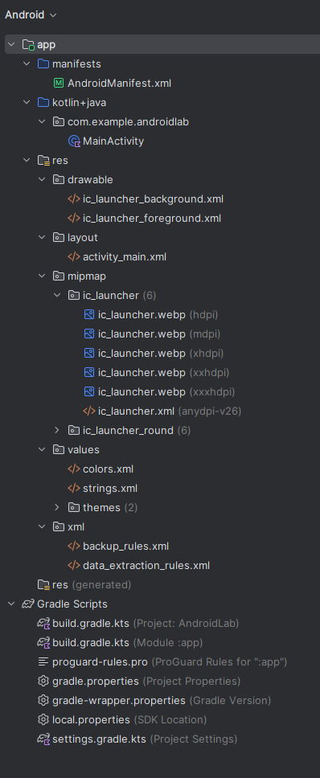
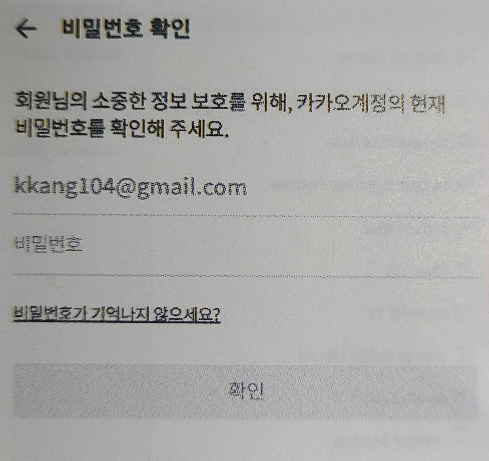
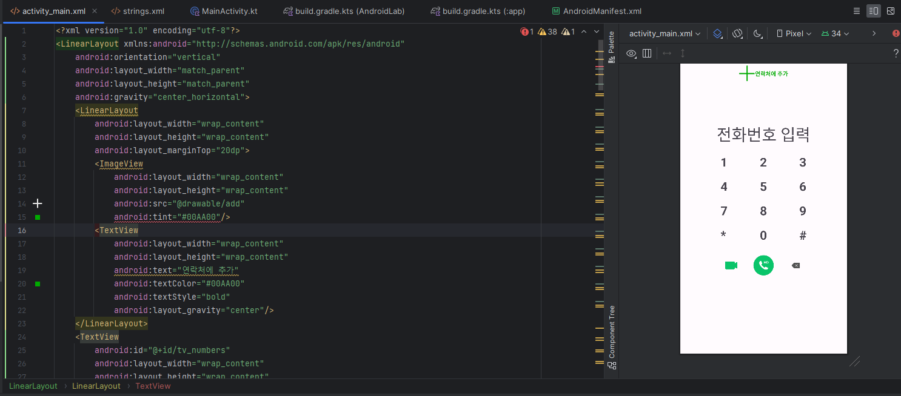
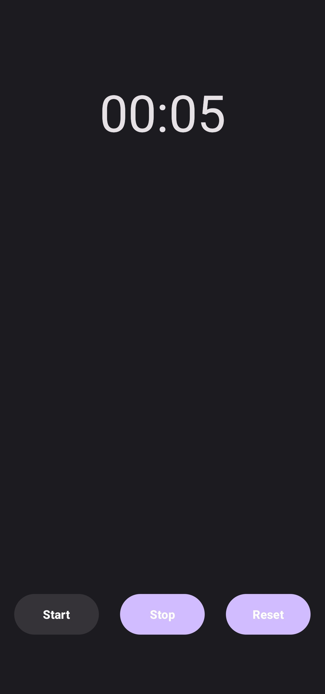

# 과제
작성자: 김정근

UserName: rungeun
## 과제1 (2024.04.02)
> 1. 컴포넌트에 대해 설명하시오.
> 2. 안드로이드 스튜디오에서 기본 엑티비티 생성시에 만들어지는 파일들에 대해 설명하시오.  
>
### 1번 해설: 
- 컴포넌트:
   - 앱 컴포넌트는 안드로이드 앱의 필수적인 <U>**구성요소**</U>로 각 <U>**독립된 형태로 존재하며 정해진 역할을 수행**</U>
   - 각 구성 요소는 시스템이나 사용자가 앱에 들어올 수 있는 <U>**진입접**</U>
   - "인텐트"는 다른 앱 컴포넌트로부터 <U>**작업을 요청**</U>하는데 사용할 수 있는 <U>**메시징 객체**</U>
   - 안드로이드는 <U>**액티비티</U>, <U>서비스</U>, <U>콘텐츠 프로바이더</U>, <U>브로드캐스트 리시버**</U>등 4종류의 컴포넌트로 앱을 개발합니다.

- 액티비티
    - 사용자가 보는 화면
    - <U>**사용자와 상호작용**</U>하기 위한 <U>**진입점**</U>
    - ex) 이메일 앱이라면 새 이메일 목록을 표시하는 액티비티 하나, 이메일을 작성하는 액티비티 하나, 이메일을 액티비티 하나 등이 존재
- 서비스
    - <U>**백그라운드**</U>에서 앱을 계속 실행하기 위한 <U>**다목적 진입점**</U>
    - <U>**사용자 인터페이스(UI)는 제공하지 않음**</U>
    - ex) 사용자가 다른 앱에 있는 동안에 백그라운드에서 음악을 재생하거나, 사용자 액티비티 간의 상호작용을 차단하지 않고 네트워크를 통해 데이터를 가져올 수 있음
- 콘텐츠 프로바이더
    - 콘텐츠 제공자는 파일 시스템, SQLite 데이터베이스, 웹상이나 앱이 접근할 수 있는 다른 모든 <U>**영구 저장소에 저장**</U>가능한 앱 데이터의 고유형 <U>**집합을 관리함**</U>
    - 다른 앱은 컨텐츠 제공자를 통해 해당 데이터를 쿼리하거나, 콘텐츠 제공자가 허용할 경우에는 수정도 가능
    - 안드로이드 시스템은 <U>**사용자의 연락처 정보를 관리하는 콘텐츠 제공자를 제공하여**</U>, 적절한 <U>**권한을 가진 앱**</U>이라면 콘텐츠 제공자를 쿼리하여 <U>**특정한 인물에 대한 정보를 읽고 쓸 수**</U> 있음
- 브로드캐스트 리시버
    - 시스템이 정기적인 사용자 플로우 밖에서 인벤트를 앱에 전달하도록 지원하는 컴포넌트
    - 대다수의 브로드캐스트는 시스템에서 발생 (화면꺼짐, 배터리부족, 사진 캡쳐 알림 등)
    - 일반 앱도 브로드캐스트를 사용하여 사용자 인터페이스를 표시하지 않지만, <U>**상태 표시줄 알림을 생성**</U>
    - ex) Push 정보 알림, 안내 역할

### 2번 해설:


- **app** : 모듈(=하나의 앱)
    - **manifests**
        - AndroidManifest.xml : 앱 환경설정 파일
    - **kotlin+java**
        - com.example.androidlab
            - MainActivity : 메인 액티비티 파일
    - **res**
        - drawable : 이미지 리소스
        - layout : UI구성에 필요한 XML 리소스
        - mipmap : 앱 아이콘 이미지
        - values : 문자열 등의 값으로 이용되는 리소스
            - colors.xml : 컬러 값이 저장됨
            - string.xml : 문자열 상수가 저장됨
- **Gradle Scripts**
    - build.gradle.kts : 빌드 설정 파일


## 과제2 (2024.04.09) 
> 1. 클래스 생성자에 대해서 설명하시오.
> 2. 클래스 상속에 대해서 설명하시오. 
> 3. 오버라이딩 - 재정의에 대해서 설명하시오.
> 4. When 조건문에 대해 설명하시오.
>
### 1번 해설:
```kotlin
class User{
    var name = "kim"
    constructor(name: String){
        this.name = name
    }
    fun someFun(){
        println("name: $name")
    }
    class SomeClass{}
}
```
생성자는 `constructor`라는 키워드로 선언한 함수입니다.

```kotlin
val user = User("kim")  // 객체 생성
user.someFun()
```
- 코틀린에서는 객체를 생성할 때 new 키워드를 사용하지 않습니다. 위 코드에서 User("kim")이 객체를 생성하는 구문이며 클래스 <U>**이름과 같은 함수로 객체를 생성**</U>합니다.
- 객체를 생성할 때 <U>**생성자가 자동으로 호출**</U>됩니다.
- 소괄호 안에 전달한 인자는 클래스에서 선언된 생성자의 <U>**매개변수와 데이터 타입이 동일**</U>해야 합니다.

<br><br>

- 주 생성자
    ```Kotlin
    class User constructor(name: String, count: Int){
        init{
            // init영역
        }
    }
    ```
    - `constructor` 키워드로 클래스 선언부에 선언
    - 한 클래스에 <U>**하나만**</U> 가능
    - `constructor`키워드는 <U>**생략**</U> 가능
    - <U>**매개변수**</U> 선언 가능
    - 주 생성자는 {}를 추가할 수 없으므로 `init`키워드를 이용해 주 생성자 본문을 구현
    - `init`키워드로 지정한 영역은 <U>**객체를 생성할 때 자동으로 실행**</U>
    ```kotlin
    class User(name: String, count: Int){
        init {
            println("name: $name, count: $count")   //샐행
        }
        fun someFun(){
            println("name: $name, count: $count")   //오류: name,count는 생성자에서만 사용 가능한 지역변수이다.
        }
    }
    ```
    - 생성자의 매개변수는 생성자에서만 사용할 수 있는 <U>**지역 변수**</U>입니다.
    - 위 코드에서는 생성자 지역변수 name, count를 someFun()에서 사용하려 했기때문에 오류가 납니다.
    ```kotlin
    // 방법 1
    class User(name: String, count: Int){
        var name: String        //클래스 멤버 변수 선언
        var count: Int          //클래스 멤버 변수 선언
        init {
            this.name = name    //클래스 멤버 변수에 생성자 매개변숫값 대입
            this.count = count  //클래스 멤버 변수에 생성자 매개변숫값 대입
        }
        fun someFun(){
            println("name: $name, count: $count") // 클래스 멤버 변수값 출력
        }
    }
    ```
    - 생성자의 매개변수를 <U>**클래스의 멤버 변수처럼**</U> 다른 함수에서 사용해야 한다면 위 코드처럼 클래스 멤버 변수에 생성자 매개변숫값 대입해야 합니다.
    ```kotlin
    // 방법2
    class User(val name: String, val count: Int){    //생성자 매개변수가 멤버변수가 됨
        fun someFun(){
            println("name: $name, count: $count") // 클래스 멤버 변수값 출력
        }
    }
    ```
    - 매개변수를 `var`, `val`키워드로 선언하면 클래스의 멤버 변수가 됩니다.
    - 함수에서는 매개변수를 선언할 때 `var`, `val`키워드를 추가 할 수 없지만 주 생성자에서만 유일하게 키워드로 매개변수 선언이 가능합니다.

- 보조 생성자
    ```kotlin
    class User{
        constructor(name: String){
            println("name: String")
        }
        constructor(name: String, count: Int){
            println("name: String, count: Int")
        }
    }
    ```
    - <U>**클래스 본문**</U>에 `constructor` 키워드로 선언한 함수
    - <U>**여러개**</U> 선언 가능
    - `{ }`로 묶어서 객체 생성과 동시에 <U>**실행할 영역을 지정**</U> 가능 
  
- 주 생성자와 보조 생성자 연결
    ```kotlin
    class User(name: String){   //(3)
        constructor(name: String, count: Int): this(name){ //(2) : 주 생성자(3)을 호출
            println("name: String, count: Int")
        }
        constructor(name: String, count: Int, email: String): this(name, count){ //(1) : 보조 생성자(2)를 호출
            println("name: String, count: Int, email: String")
        }
    }

    fun main(){
        val user = User("kim", 10, "hello@hello.com")   //보조 생성자(1)를 호출
    }
    ```
    - 주 생성자와 보조 생성자를 모두 선언한다면 반드시 <U>**생성자끼리 연결**</U>해 주어여 합니다
    - 보조 생성자에서 `this()` 구문으로 주생성자 호출해야 합니다.
    - 보조 생성자를 여러 개 선언 한다면 보조 생성자에서 `this()`로 다른 보조 생성자를 호출할 수 있습니다.

### 2번 해설:
```kotlin
open class Super(name: String){   // 상속할 수 있게 open 키워드 사용
}
class Sub(name: String): Super(name){ // Super를 상속받아 Sub 클래스 선언
}
```
```kotlin
open class Super(name: String){   // 상속할 수 있게 open 키워드 사용
}
class Sub: Super{
    constructor(name: String): super(name){
    }
}
```
- 상속: 클래스를 선언할 때 다른 클래스를 참조해서 선언하는 것
- 선언부에 콜론(`:`)과 함께 상속받을 클래스 이름을 입력
- 상위 클래스: 상속 대상이 되는 클래스
- 하위 클래스: 상속 받는 클래스
- `open`키워드를 사용해서 클래스를 선언해야 다른 클래스에서 상속할 수 있습니다.
- 만약 매개변수가 있는 상위 클래스의 생성자를 호출할 때는 매개변수 구성에 맞게 인자를 전달해야 합니다.

### 3번 해설:
오버라이딩: 상위 클래스에 선언된 변수나 <U>**함수**</U>를 같은 이름으로 하위 클래스에서 <U>**다시 한번 선언**</U>하는 것
```kotlin
open class Super{
    open var someData =10
    open fun someFun(){
        println("i am super class function: $someData")
    }
}
class Sub: Super(){ //Super클래스를 상속받은 하위 클래스 Sub
    override var someData = 20
    override fun someFun(){
        println("i am sub class function: $someData")
    }
}

fun main(){
    val obj = Sub()
    obj.someFun()
}
```
- `open`
    - 상위 클래스에서 오버라이딩을 허용할 변수나 함수 선언 앞에 `open`키워드를 추가합니다.
    - `open`키워드로 선언하지 않으면 하위 클래스에서 재정의할 수 없습니다.
- `override`
    - 변수나 함수를 하위 클래스에서 재정의 할 때는 반드시 선언문 앞에 `override`라는 키워드를 추가해야 합니다.

### 4번 해설:
```kotlin
fun main(){
    var data = 10
    when (data){
        10 -> println("data is 10")     // 해당 구문 실행
        20 -> println("data is 20")
        else -> { println("data is not valid data")}
    }
}
```
- when키워드 다음의 소괄호 ()안에 넣은 데이터가 조건이 되고 이 값에 따라 각 구문을 실행합니다.

- else문은 생략 가능
```kotlin
    when (data){
        is String -> println("data is String") // data가 문자열 타입이면 실행
        in 1..9 -> println("data is 1..9") // data가 1~9의 값이면 실행
        10, 20 -> println("data is 10 or 20")  //data가 10 또는 20이면 실행
        else -> { println("data is not valid")}
    }

```
- `is`는 타입을 확인하는 연산자

- `in`은 범위 지정 연산자
```kotlin
fun main(){
    var data = 10
    val result = when{
        data <= 0 -> "data is <=0"
        data > 100 -> "data is >100"
        else -> "data is not valid"
    }
    println(resul)
}

```
- when문을 **표현식**으로 사용하여 when문의 실행 결과를 반환할 수 있습니다.
- when문을 표현식으로 사용할때는 else문 **생략할 수 없다**

## 과제3 (2024.04.016)
> 1. 레이아웃XML로 카카오톡 비밀번호 확인 화면을 사진과 같이 만들어 오시오.
> 
>

### 1번 해설:

```xml
<!--string.xml-->
<resources>
    <string name="app_name">카카오톡 로그인</string>
    <string name="pw_information">회원님의 소중한 정보 보흐를 위해, 카카오계정의 현재 비밀번호를 확인해 주세요.</string>
    <string name="pw_lost">비밀번호가 기억나지 않으세요?</string>
    <string name="pw_id">abc1234@gmail.com</string>
    <string name="pw_password">비밀번호</string>
    <string name="pw_check">확인</string>
</resources>
```
```xml
<!--activity_main.xml-->
<?xml version="1.0" encoding="utf-8"?>
<LinearLayout xmlns:android="http://schemas.android.com/apk/res/android"
    android:layout_width="match_parent"
    android:layout_height="match_parent"
    android:orientation="vertical"
    android:padding="16dp">
    
    <TextView
        android:layout_width="match_parent"
        android:layout_height="wrap_content"
        android:text="@string/pw_information"
        android:textSize="16sp"/>
    <TextView
        android:layout_width="match_parent"
        android:layout_height="wrap_content"
        android:text="@string/pw_id"
        android:textColor="#CFCFCE"
        android:layout_marginTop="10sp"/>
    <View
        android:layout_width="match_parent"
        android:layout_height="1dp"
        android:background="#D4D4D3"
        android:layout_marginTop="10sp"/>
    <EditText
        android:layout_width="match_parent"
        android:layout_height="wrap_content"
        android:hint="@string/pw_password"
        android:inputType="textPassword"/>
    <TextView
        android:layout_width="match_parent"
        android:layout_height="wrap_content"
        android:text="@string/pw_lost"
        android:layout_marginTop="10sp"/>
    <Button
        android:layout_width="match_parent"
        android:layout_height="wrap_content"
        android:text="@string/pw_check"
        android:layout_marginTop="16dp"/>
</LinearLayout>
```
```kotlin
// MainActivity.kt
package com.example.androidlab

import androidx.appcompat.app.AppCompatActivity
import android.os.Bundle
import com.example.androidlab.databinding.ActivityMainBinding

class MainActivity : AppCompatActivity() {
    override fun onCreate(savedInstanceState: Bundle?) {
        super.onCreate(savedInstanceState)
        // 바인딩 객체 획득
        val binding = ActivityMainBinding.inflate(layoutInflater)
        // 액티비티 화면 출력
        setContentView(binding.root)
    }
}
```
## 과제4 (2024.04.023)
> 1. 교재를 참고하여 전화 앱의 키패드 화면을 만드시오.
> 
>

### 1번 해설:

```xml
<?xml version="1.0" encoding="utf-8"?>
<LinearLayout xmlns:android="http://schemas.android.com/apk/res/android"
    android:orientation="vertical"
    android:layout_width="match_parent"
    android:layout_height="match_parent"
    android:gravity="center_horizontal">
    <LinearLayout
        android:layout_width="wrap_content"
        android:layout_height="wrap_content"
        android:layout_marginTop="20dp">
        <ImageView
            android:layout_width="wrap_content"
            android:layout_height="wrap_content"
            android:src="@drawable/add"
            android:tint="#00AA00"/>
        <TextView
            android:layout_width="wrap_content"
            android:layout_height="wrap_content"
            android:text="연락처에 추가"
            android:textColor="#00AA00"
            android:textStyle="bold"
            android:layout_gravity="center"/>
    </LinearLayout>
    <TextView
        android:id="@+id/tv_numbers"
        android:layout_width="wrap_content"
        android:layout_height="wrap_content"
        android:layout_marginTop="100dp"
        android:text="전화번호 입력"
        android:textSize="40dp"/>
    <GridLayout
        android:layout_width="wrap_content"
        android:layout_height="wrap_content"
        android:orientation="horizontal"
        android:columnCount="3"
        android:layout_marginTop="10dp">
        <TextView
            android:id="@+id/one"
            android:text="1"
            android:textSize="30dp"
            android:textStyle="bold"
            android:paddingLeft="40dp"
            android:paddingRight="40dp"
            android:paddingBottom="10dp"
            android:paddingTop="10dp"/>
        <TextView
            android:id="@+id/two"
            android:text="2"
            android:textSize="30dp"
            android:textStyle="bold"
            android:paddingLeft="40dp"
            android:paddingRight="40dp"
            android:paddingBottom="10dp"
            android:paddingTop="10dp"/>
        <TextView
            android:id="@+id/three"
            android:text="3"
            android:textSize="30dp"
            android:textStyle="bold"
            android:paddingLeft="40dp"
            android:paddingRight="40dp"
            android:paddingBottom="10dp"
            android:paddingTop="10dp"/>
        <TextView
            android:id="@+id/four"
            android:text="4"
            android:textSize="30dp"
            android:textStyle="bold"
            android:paddingLeft="40dp"
            android:paddingRight="40dp"
            android:paddingBottom="10dp"
            android:paddingTop="10dp"/>
        <TextView
            android:id="@+id/five"
            android:text="5"
            android:textSize="30dp"
            android:textStyle="bold"
            android:paddingLeft="40dp"
            android:paddingRight="40dp"
            android:paddingBottom="10dp"
            android:paddingTop="10dp"/>
        <TextView
            android:id="@+id/six"
            android:text="6"
            android:textSize="30dp"
            android:textStyle="bold"
            android:paddingLeft="40dp"
            android:paddingRight="40dp"
            android:paddingBottom="10dp"
            android:paddingTop="10dp"/>
        <TextView
            android:id="@+id/seven"
            android:text="7"
            android:textSize="30dp"
            android:textStyle="bold"
            android:paddingLeft="40dp"
            android:paddingRight="40dp"
            android:paddingBottom="10dp"
            android:paddingTop="10dp"/>
        <TextView
            android:id="@+id/eight"
            android:text="8"
            android:textSize="30dp"
            android:textStyle="bold"
            android:paddingLeft="40dp"
            android:paddingRight="40dp"
            android:paddingBottom="10dp"
            android:paddingTop="10dp"/>
        <TextView
            android:id="@+id/nine"
            android:text="9"
            android:textSize="30dp"
            android:textStyle="bold"
            android:paddingLeft="40dp"
            android:paddingRight="40dp"
            android:paddingBottom="10dp"
            android:paddingTop="10dp"/>
        <TextView
            android:id="@+id/star"
            android:text="*"
            android:textSize="30dp"
            android:textStyle="bold"
            android:paddingLeft="40dp"
            android:paddingRight="40dp"
            android:paddingBottom="10dp"
            android:paddingTop="10dp"/>
        <TextView
            android:id="@+id/zero"
            android:text="0"
            android:textSize="30dp"
            android:textStyle="bold"
            android:paddingLeft="40dp"
            android:paddingRight="40dp"
            android:paddingBottom="10dp"
            android:paddingTop="10dp"/>
        <TextView
            android:id="@+id/sharp"
            android:text="#"
            android:textSize="30dp"
            android:textStyle="bold"
            android:paddingLeft="40dp"
            android:paddingRight="40dp"
            android:paddingBottom="10dp"
            android:paddingTop="10dp"/>
    </GridLayout>
    <RelativeLayout
        android:layout_width="wrap_content"
        android:layout_height="wrap_content"
        android:layout_marginTop="20dp">
        <ImageView
            android:id="@+id/icon_video"
            android:src="@drawable/video"
            android:layout_width="50dp"
            android:layout_height="50dp"
            android:layout_marginRight="30dp"/>
        <ImageView
            android:id="@+id/icon_call"
            android:layout_height="50dp"
            android:layout_width="50dp"
            android:src="@drawable/call"
            android:layout_toRightOf="@+id/icon_video"/>
        <ImageView
            android:id="@+id/icon_back"
            android:layout_height="50dp"
            android:layout_width="50dp"
            android:src="@drawable/back"
            android:layout_toRightOf="@+id/icon_call"
            android:layout_marginLeft="30dp"/>
    </RelativeLayout>
</LinearLayout>
```

## 과제5 (2024.04.30)
> 1. 시계 앱의 스톱워치 기능을 교재를 참고하여 만드시오.
>
>

### 1번 해설:



```xml
<!--res/drawable/round_button.xml-->
<?xml version="1.0" encoding="utf-8"?>
<shape xmlns:android="http://schemas.android.com/apk/res/android"
    android:shap="rectangle" android:padding="10dp">
    <solid android:color="#6666FF"></solid>
    <corners
        android:bottomLeftRadius="30dp"
        android:bottomRightRadius="30dp"
        android:topLeftRadius="30dp"
        android:topRightRadius="30dp"/>
</shape>
```

```xml
<!--activity_main.xml-->
<?xml version="1.0" encoding="utf-8"?>
<RelativeLayout xmlns:android="http://schemas.android.com/apk/res/android"
    android:layout_width="match_parent"
    android:layout_height="match_parent">
    <Chronometer
        android:id="@+id/chronometer"
        android:layout_width="match_parent"
        android:layout_height="wrap_content"
        android:layout_margin="100dp"
        android:gravity="center_horizontal"
        android:textSize="60dp"/>
    <LinearLayout
        android:layout_width="match_parent"
        android:layout_height="wrap_content"
        android:gravity="center_horizontal"
        android:orientation="horizontal"
        android:layout_alignParentBottom="true"
        android:layout_marginBottom="70dp">
        <Button
            android:id="@+id/startButton"
            android:layout_width="100dp"
            android:layout_height="wrap_content"
            android:text="Start"
            android:background="@drawable/round_button"
            android:textColor="#FFFFFF"
            android:textStyle="bold"/>
        <Button
            android:id="@+id/stopButton"
            android:layout_width="100dp"
            android:layout_height="wrap_content"
            android:text="Stop"
            android:background="@drawable/round_button"
            android:textColor="#FFFFFF"
            android:textStyle="bold"
            android:layout_marginLeft="25dp"
            android:enabled="false"/>
        <Button
            android:id="@+id/resetButton"
            android:layout_width="100dp"
            android:layout_height="wrap_content"
            android:text="Reset"
            android:background="@drawable/round_button"
            android:textColor="#FFFFFF"
            android:textStyle="bold"
            android:layout_marginLeft="25dp"
            android:enabled="false"/>
    </LinearLayout>
</RelativeLayout>
```

```kotlin
//MainActivity.kt
package com.example.androidlab

import androidx.appcompat.app.AppCompatActivity
import android.os.Bundle
import android.os.SystemClock
import android.view.KeyEvent
import android.widget.Toast
import com.example.androidlab.databinding.ActivityMainBinding

class MainActivity : AppCompatActivity() {
    // 뒤로가기 버튼을 누른 시각을 저장하는 속성
    var initTime = 0L
    // 멈춘 시각을 저장하는 속성
    var pauseTime = 0L

    override fun onCreate(savedInstanceState: Bundle?) {
        super.onCreate(savedInstanceState)
        // 바인딩 객체 획득
        val binding = ActivityMainBinding.inflate(layoutInflater)
        // 액티비티 화면 출력
        setContentView(binding.root)

        binding.startButton.setOnClickListener {
            binding.chronometer.base = SystemClock.elapsedRealtime() + pauseTime
            binding.chronometer.start()
            // 버튼 표시 여부 조정
            binding.stopButton.isEnabled = true
            binding.startButton.isEnabled = false
            binding.resetButton.isEnabled = true
        }
        binding.stopButton.setOnClickListener {
            pauseTime = binding.chronometer.base - SystemClock.elapsedRealtime()
            binding.chronometer.stop()
            binding.stopButton.isEnabled = false
            binding.startButton.isEnabled = true
            binding.resetButton.isEnabled = true
        }
        binding.resetButton.setOnClickListener {
            pauseTime = 0L
            binding.chronometer.base = SystemClock.elapsedRealtime()
            binding.chronometer.stop()
            binding.stopButton.isEnabled = false
            binding.startButton.isEnabled = true
            binding.resetButton.isEnabled = false
        }
    }
    // 뒤로가기 버튼 이벤트 핸들러
    override fun onKeyDown(keyCode: Int, event: KeyEvent?): Boolean {
        // 뒤로가기 버튼을 눌렀을 때 처리
        if(keyCode == KeyEvent.KEYCODE_BACK){
            //
            if(System.currentTimeMillis() - initTime > 3000){
                Toast.makeText(this, "종료하려면 한 번 더 누르세요!", Toast.LENGTH_SHORT).show()
                initTime = System.currentTimeMillis()
                return true
            }
        }
        return super.onKeyDown(keyCode, event)
    }
}
```
## 과제6 (2024.05.07)
> 내용1
>
>
### 1번 해설:
### 2번 해설:
### 3번 해설:

## 과제7 (2024.05.14)
> 내용1
>
>
### 1번 해설:
### 2번 해설:
### 3번 해설:

## 과제8 (2024.05.21)
> 내용1
>
>
### 1번 해설:
### 2번 해설:
### 3번 해설:

## 과제9 (2024.05.28)
> 내용1
>
>
### 1번 해설:
### 2번 해설:
### 3번 해설:

## 과제10 (2024.06.04)
> 내용1
>
>
### 1번 해설:
### 2번 해설:
### 3번 해설:

## 과제11 (2024.06.011)
> 내용1
>
>
### 1번 해설:
### 2번 해설:
### 3번 해설:

## 과제12 (2024.06.018)
> 내용1
>
>
### 1번 해설:
### 2번 해설:
### 3번 해설:

## 과제13 (2024.06.025)
> 내용1
>
>
### 1번 해설:
### 2번 해설:
### 3번 해설:
